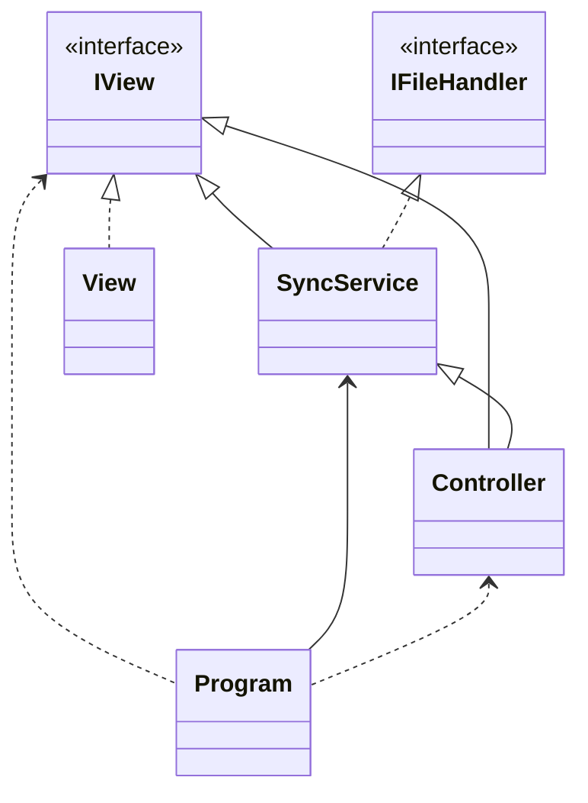

# VEEAM QA exercise

## Author of solution

Steven Hall

### How to run the project?

The first command after cloning/downloading should be dotnet build as some necessary files are ignored by .gitignore file.

```sh
dotnet build
```

- command example Nº1:

```sh
dotnet run --project SyncTask -- "C:\Users\steve\Desktop\SourceFolder" "C:\Users\steve\Desktop\CloneFolder" 3 "C:\Users\steve\Desktop\LogOutput\log.txt"
```

- command example Nº2:

Inside the project folder run the following command:

```sh
dotnet run -- "C:\Users\steve\Desktop\SourceFolder" "C:\Users\steve\Desktop\CloneFolder" 3 "C:\Users\steve\Desktop\LogOutput\log.txt"
```

## Simple UML



## Code main points

_Program_ Initializes MVC classes and starts the c# program.

```csharp
private static void Main(string[] args)
{

    // New abstract IView as concrete View
    IView view = new View();

    // new Model
    IFileHandler model = new SyncService(view);

    // new Controller
    // accepts a model and a view
    Controller controller = new Controller(model, view);

    // start controller
    controller.Start(args);
}


```

If previous operations are sucessfull, the class is called and Syncronization begins.

```csharp
_fileHandler.CloneFolder(folderPath, clonePath, logPath);
```

```csharp
_fileHandler.CloneFolder(folderPath, clonePath, logPath);
```
