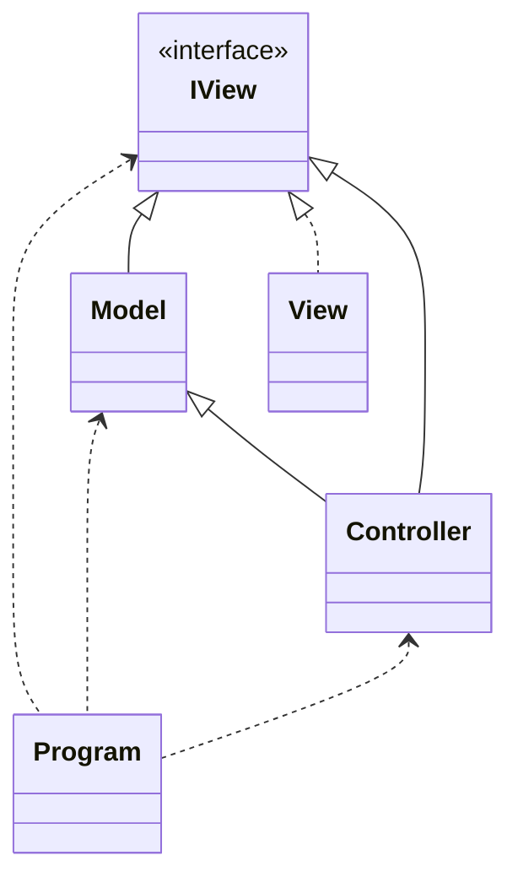

# VEEAM QA exercise

Author of solution:

- Steven Hall

## How to run the project?

The first command after cloning/downloading should be dotnet build as some necessary files are ignored by .gitignore file.

```sh
dotnet build
```

- command example Nº1:

```sh
dotnet run --project SyncTask -- "C:\Users\steve\Desktop\SourceFolder" "C:\Users\steve\Desktop\CloneFolder" 10 "C:\Users\steve\Desktop\LogOutput\log.txt"
```

- command example Nº2:

Inside the project folder run the following command:

```sh
dotnet run -- "C:\Users\steve\Desktop\SourceFolder" "C:\Users\steve\Desktop\CloneFolder" 10 "C:\Users\steve\Desktop\LogOutput\log.txt"
```

### UML Solution


