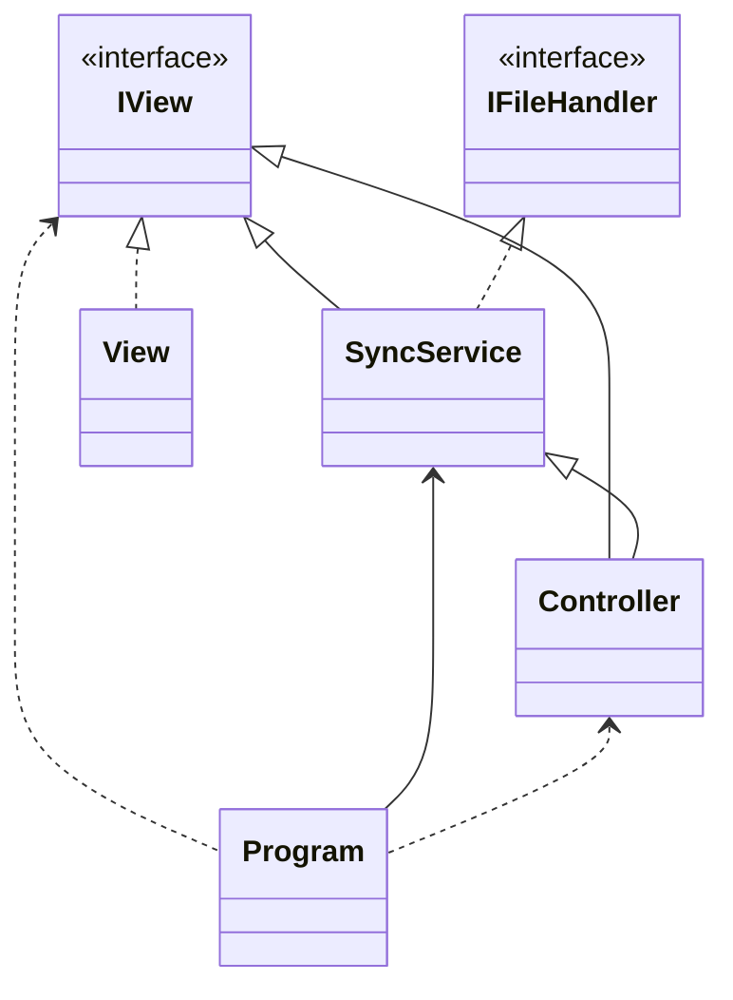

# VEEAM QA exercise

## Author of solution

Steven Hall

### How to run the project?

The first command after cloning/downloading should be dotnet build as some necessary files are ignored by .gitignore file.

```sh
dotnet build
```

- command example Nº1:

```sh
dotnet run --project SyncTask -- "C:\Users\steve\Desktop\SourceFolder" "C:\Users\steve\Desktop\CloneFolder" 3 "C:\Users\steve\Desktop\LogOutput\log.txt"
```

- command example Nº2:

Inside the project folder run the following command:

```sh
dotnet run -- "C:\Users\steve\Desktop\SourceFolder" "C:\Users\steve\Desktop\CloneFolder" 3 "C:\Users\steve\Desktop\LogOutput\log.txt"
```

## Simple UML



## Code main points

_Program_ Initializes MVC classes and starts the c# program.

```csharp
private static void Main(string[] args)
{

    // New abstract IView as concrete View
    IView view = new View();

    // new Model
    IFileHandler model = new SyncService(view);

    // new Controller
    // accepts a model and a view
    Controller controller = new Controller(model, view);

    // start controller
    controller.Start(args);
}


```

If previous operations are sucessfull, the class is called and Syncronization begins. Here is also the control loop with the given interval.

```csharp
// while loop
do
{
    _view.Message("\n\nPress ENTER to exit\n\n", ConsoleColor.Gray);

    // Clone folder
    _fileHandler.CloneFolder(folderPath, clonePath, logPath);

    // loop iwth interval
    for (int i = 0; i < interval; i++)
    {
        // display timer to user
        _view.Message($"{interval - i}");

        // wait for 1 second
        System.Threading.Thread.Sleep(1000);
    }

}
// check if user pressed escape key (enter key)
// if so, terminate the loop
while (!_view.GetEscKey());

// display final message to user
_view.Message("\n\nThanks for using Sync Task!");
```

Example of file processing

```csharp
 // Foreach file in the directory
// Obtain and copy all files!
foreach (string filePath in Directory.GetFiles(sourcePath))
{
    // Try to copy file to destination
    try
    {
        // Get file name
        string fileName = Path.GetFileName(filePath);

        // path of destination file
        string destFilePath = Path.Combine(destFolder, fileName);

        // Copy file, with file destination & overwrite it
        // Any file will be overwritten!
        File.Copy(filePath, destFilePath, true);

        // Display message to user
        LogInfo($"File: {fileName} copied to {destFilePath}");

    }

    // catch exception if file cannot be copied
    catch (IOException e)
    {
        // Display error message
        LogInfo($"Error copying file: {e.Message}",
            ConsoleColor.Red);
    }
}
```

Any information will logged with Logger class

```csharp
// add log
public void AddLog(string logText, ConsoleColor color)
{
    // display message in console
    _view.Message(logText, color);

    // update log text
    UpdateLogText(logText);
}

// update string builder
private void UpdateLogText(string logText)
{
    // add log to string builder
    _sb.AppendLine(logText + "\n");
}

// Here the log file is saved!
public void WriteLogFile(string path)
{
    try
    {
        // append final message to log
        _sb.AppendLine("\nThanks for using SyncTask!\n");

        // ...

        // Create a new file and write the log to it
        using StreamWriter sw = new StreamWriter(path);

        // write log to file
        sw.Write(_sb.ToString());

        // display path of log message in console
        _view.Message($"Log file created at {path}",
            ConsoleColor.DarkBlue);
    }

    // ...
}
```
